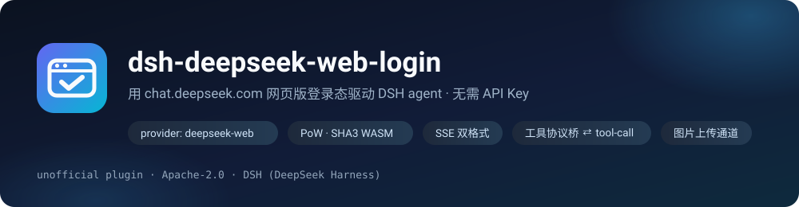
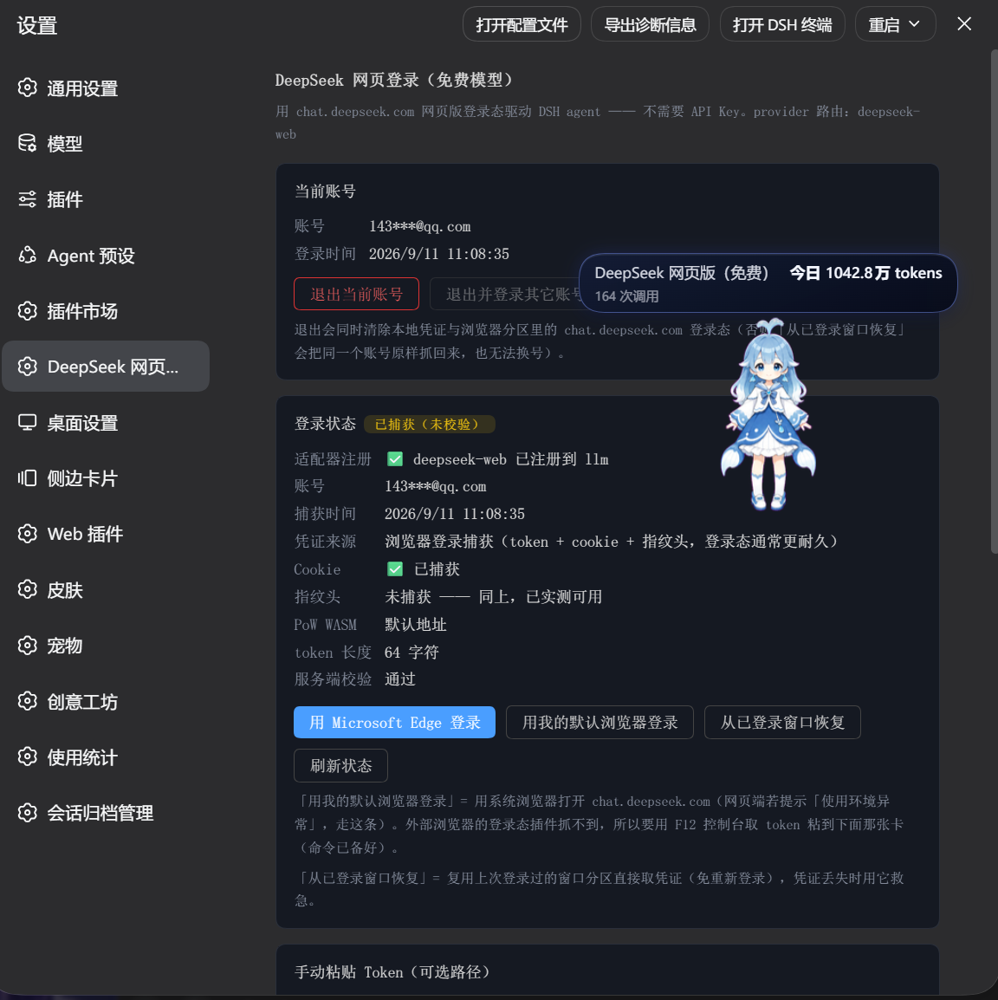
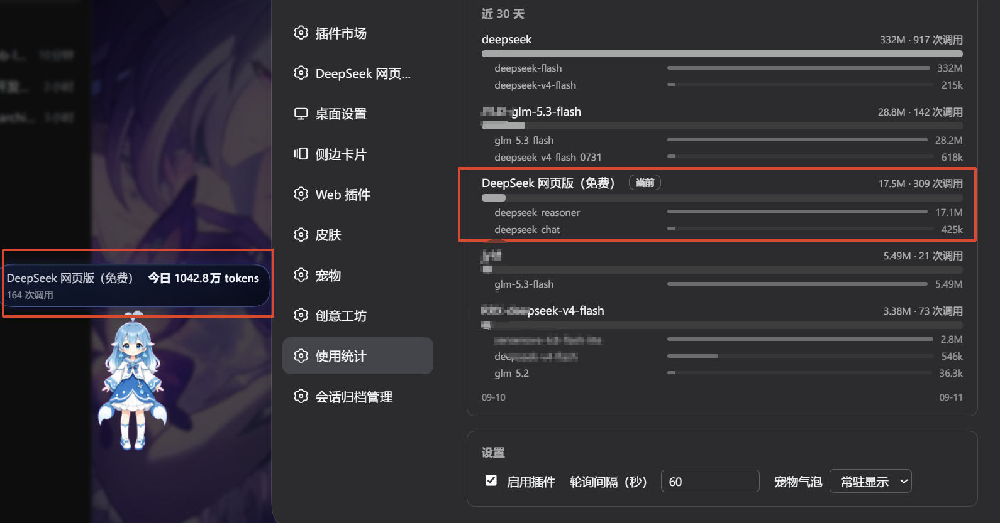
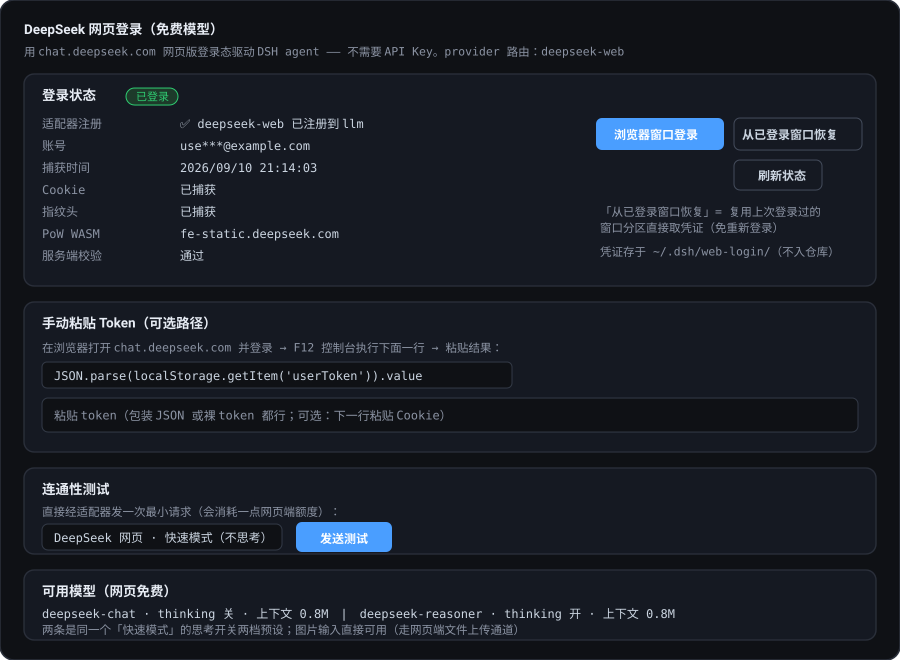
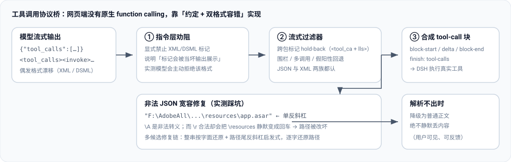
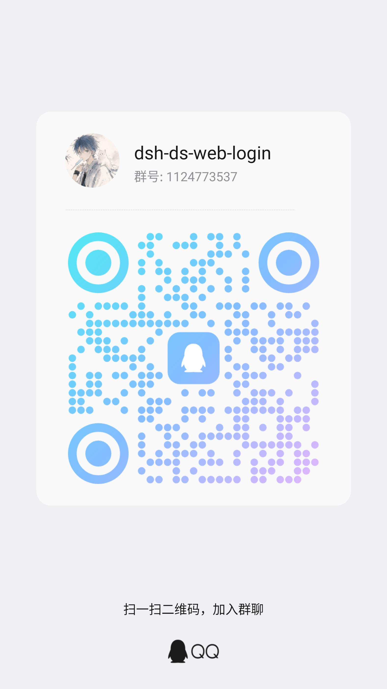

<div align="center">



[**中文**](README.md) · [English](README.en.md)

<!-- badges -->
[](LICENSE)
[](https://github.com/deepseek-ai/deepseek-harness)
[](#模型档位)
[](#测试与验证)
[](https://github.com/cv-superding/dsh-deepseek-web-login/actions/workflows/ci.yml)
[](https://github.com/cv-superding/dsh-deepseek-web-login/releases)
[](#免责声明)
[](#贡献)
[](#开发)

**把 chat.deepseek.com 网页版接进 DSH：用浏览器登录态（不是 API Key）驱动 agent 的工具调用、思考流与图片理解。**

</div>

---

## 这是什么

DSH（DeepSeek Harness）通过 `ctx.llm` 的 **provider 适配器**接入模型。本项目实现了 `deepseek-web`
这个 provider —— 它不调用官方 API，而是复用你**已登录的网页版**：PoW 挑战、会话、SSE 流式、
文件上传，全部走网页端私有接口。

于是：**在模型选择器里选 `DeepSeek 网页 · 快速模式`，就能用网页版免费额度跑 DSH 的 agent**。

```text
DSH agent loop ──▶ ctx.llm ──▶ [deepseek-web 适配器] ──▶ chat.deepseek.com
                                     │  ├─ PoW（SHA3 WASM 求解）
                                     │  ├─ chat_session（每次调用临时会话，用完即删）
                                     │  ├─ chat/completion（SSE patch 流）
                                     │  └─ file/upload_file（图片输入）
                                     └─ 提示词工具协议 ⇄ tool-call 块
```


## 它是怎么工作的（以及为什么不是「反代」）

被问得最多的两个问题：**你们是操作 DOM，还是截获页面的请求？是不是个反代？**
答案都是**不是** —— 它自己构造请求、直接发给网页端私有接口。准确的说法是
「**网页端私有接口的非官方客户端**」。逐步拆开：

| 阶段 | 做什么 | 用什么 |
| --- | --- | --- |
| **① 登录捕获**（只做一次） | 开一个**独立 profile** 的浏览器窗口让你登录，把页面自己发出的请求头读一份存下来：`Authorization: Bearer`、域 cookie、反爬头 `x-hif-dliq` / `x-hif-leim`、一批 `x-client-*` | Electron 的 `webRequest.onBeforeSendHeaders` |
| **② 请求构造**（每次调用） | 自己拼 `POST /api/v0/chat/completion`；PoW 自己解：先要 `create_pow_challenge`，再用 SHA3 WASM 算出答案塞进 `x-ds-pow-response` | 插件自己的 HTTP 客户端 |
| **③ 发送** | 默认从 **Chromium 网络栈**出去（Electron `net.fetch`），TLS / HTTP2 指纹与真实浏览器一致；也可切回 Node | 见下方「传输层」 |
| **④ 解析与对接** | 自己解 `response/fragments` 的 SSE 帧、分思考与正文通道；工具调用走**提示词协议**（网页端没有原生 function calling） | 自研解析器 |

**唯一沾到"截获"的只有第 ① 步**，而且那一步是「读一份 + 清掉自己的痕迹」：同一个回调顺手把请求头里的
Electron 品牌（UA 与 UA-CH）删掉，否则网页端会判「使用环境异常」。它**不改写业务请求、也不转发任何东西**，
而且只在登录那一次生效 —— **登录完之后页面关掉，插件照样跑。**

### 为什么不是「反代」

反代（反向代理）的关键是**中间人**：客户端以为自己在跟原服务器说话，实际请求被转发了一层。
这里没有中间人 —— **插件自己就是那个客户端**，以网页端的身份直连 DeepSeek。
中间没有转发层，也不需要额外跑一个本地服务。

### 和另外两条常见路线的区别

| | DOM 自动化（如 cuckoo-code） | 请求 hook（浏览器扩展，如 deepseek-pp） | 本插件 |
| --- | --- | --- | --- |
| **请求由谁发出** | **页面** | **页面** | **插件自己** |
| 登录态来源 | 人在窗口里手动登 | 你日常浏览器里的登录态 | 开窗捕获一次、存在本机 |
| 网页改版会怎样 | 选择器一改就坏 | 只依赖接口路径 | 只依赖接口，完全不碰 DOM |
| 浏览器要一直开着吗 | 是 | 是 | **否** |

前两条路线的共同点是「**请求是浏览器发的**」，只有本插件是发送方。代价是接口变了要跟着改；
换来的是不依赖 DOM、可以后台无人值守地跑。

## 界面预览

设置页按用途分成 **6 个标签**（一次只显示一页）—— **账号**（登录状态 / 当前账号 / **账号库** / 手动 Token）·
**模型**（可用模型 / 连通性测试）· **防风控**（请求节流 / 会话清理及其三个区间 / **调用台账**）·
**传输层**（指纹 + 一键测试）· **上下文**（每轮全量 / 链式投喂）· **关于**（版本与更新 / 数据位置 / 风险说明）。
操作反馈条常驻在标签栏之上，切到哪一页都看得见。

设置页（**真实截图**，拍于拆页之前）：当前账号 / 登录状态（适配器注册、凭证来源、PoW WASM、服务端校验）/ 三种登录方式（Microsoft Edge · 我的默认浏览器 · 从已登录窗口恢复）/ 手动粘贴 token。



DSH「使用统计」里看到的调用量 —— 免费网页通道，当日 1042.8 万 tokens / 164 次调用：



设置页**示意图**（标注各区块用途）：登录状态 / **当前账号（退出当前账号 · 退出并登录其它账号）** / 浏览器窗口登录 / 从已登录窗口恢复 / 手动 token / 连通性测试 / 模型列表。



## 核心能力

| 能力 | 说明 |
|---|---|
| 🔐 **网页登录（无 API Key）** | Electron 独立分区窗口里正常登录，插件**旁路捕获**真实 `Authorization`、cookie、`x-hif-*` 指纹头与客户端版本头 |
| 🧩 **PoW 求解** | `create_pow_challenge` + DeepSeek 自家 `sha3_wasm_bg.*.wasm` 的 `wasm_solve`；WASM 地址**自动发现**（哈希随部署变化），失败自动回退 |
| 🌊 **流式** | 同时兼容 `response/fragments`（THINK/RESPONSE 片段）与直连 `thinking_content`/`content` 两套 SSE 格式，含 `{o:"APPEND"}` 与裸 `{v}` 续段；按逻辑流去重，快照重放不重复吐字 |
| 🛠 **工具调用** | 网页端没有原生 function calling → 提示词 JSON 协议 + 流式过滤器（跨包标记、围栏、多调用、假阳性回退）→ 合成 `tool-call` 块并给出 `finish: tool-calls`；工具定义按 5.6 万字符预算整段下发，超预算时**列出被省略的工具名**并要求模型别猜参数 |
| 🛡 **格式漂移双保险** | ① 指令层显式禁止 XML/DSML 标记并说明后果（实测模型会主动拒绝该格式）；② 解析层同时容忍 JSON 与 XML/DSML 两族（`\|DSML\|` 前缀、`dsml-` 连字符、裸 `<invoke>`、CDATA） |
| 🩹 **非法 JSON 宽容修复** | 模型常把 Windows 路径写成单反斜杠：`\A` 是非法转义，而 `\r` **合法**却会把 `\resources` 静默变成回车。多候选修复链逐字还原路径，解析不出才降级为正文（**绝不静默丢内容**） |
| 🖼 **图片输入** | 走网页端文件上传通道（`/api/v0/file/upload_file` → `ref_file_ids`），同一张图在多处出现时自动去重（服务端拒绝重复 id）。实测：上传自造的「左红右蓝」PNG，模型答出「左=红色，右=蓝色」 |
| 🧹 **会话卫生** | 每次调用新建临时会话并在结束后删除 —— 实测调用前后网页端会话列表**完全一致**，不污染你的聊天记录 |
| 🎛 **设置面板** | 状态展示、**退出当前账号 / 退出并登录其它账号**（连带清除浏览器分区登录态）、浏览器登录、从已登录窗口恢复、手动粘贴 token、连通性测试（host HTTP API：`/deepseek-web-login/api/*`） |



<details>
<summary><b>登录与凭证捕获流程（点击展开）</b></summary>


</details>

## 快速开始

### 1. 安装

```bash
# 方式 A：从 Release 的 tgz 装配（推荐，免构建；版本号以最新 Release 为准）
dsh plugin --profile desktop add ./dsh-deepseek-web-login-0.1.3.tgz

# 方式 B：git 装配（本机需可访问 github.com）
dsh plugin --profile desktop add github:cv-superding/dsh-deepseek-web-login
```

> `--profile desktop` 是 DSH Desktop（Electron 应用）使用的 profile。若你跑的是 web profile，换成 `--profile web`。
> 重启 DSH 后生效（本插件是 bundle 装配，重启即自动加载）。

### 2. 登录一次

**设置 → DeepSeek 网页登录 → 浏览器窗口登录**，在弹出的窗口里正常登录（手机号 / 邮箱 / 验证码均可）。
登录窗口报的是**干净 Chrome UA**（不含 Electron 字样，UA-CH 品牌也清过）—— 否则网页端会判定
「使用环境异常」直接拒绝服务；若仍被拦，用同一行的 **用我的默认浏览器登录**，按提示用 F12 取 token 粘贴。
捕获成功后窗口自动关闭，面板显示**已登录**。

> 💡 **这个按钮每次都会先清掉上次的登录状态** —— 登录用的是独立 profile
> （`~/.dsh/web-login/browser-profile`，**不碰你日常 Edge 的 cookie 与历史**），
> 所以窗口一打开就是干净的登录页，不会带着上一个账号。
> 想省一次输入（凭证明明还有效、只是要重新捕获）就用账号行上的「**重登**」——
> 那条路**默认不清**，浏览器里若还留着登录态会立刻复用、一个密码都不用敲。
> ⚠️ 但**如果这条账号已经被标记失效**（红标「需要重新登录」），它就会先清掉再让你重新登录 ——
> 因为此时浏览器里那份登录态**也已经不可用**，复用只会把同一个坏凭证再抓一遍（会陷入点多少遍都失败的死循环）。

- 凭证只存在本机 `~/.dsh/web-login/deepseek-auth.json`，**不在仓库里**；面板「当前账号 → 退出当前账号」一键清除（同时清掉浏览器分区里的登录态，保证真退出、可换号）
- 凭证丢了或校验不通过：点 **从已登录窗口恢复**（复用上次登录的持久化分区，无需重新登录）
- 非 Electron 环境（纯 web profile）：用面板里的**手动粘贴 Token**通道

### 3. 选模型开跑

模型选择器 → provider **`DeepSeek 网页版（免费）`** → `DeepSeek 网页 · 快速模式`，
然后照常用 agent（工具调用、思考流、贴图都可用）。

> ⚠️ **一个账号同时只开一个聊天窗口**：多开并发会触发网页端临时封禁（1 天）——要开多个窗口就换账号，或把多余的窗口换到别的 provider。详见[已知限制](#已知限制)。

## 模型档位

权威依据：`GET /api/v0/client/settings?scope=model` 的 `model_configs`（按账号返回，实测 configVersion 81）

| model_type | 名称 | enabled | switchable |
|---|---|---|---|
| `default` | 快速模式 | ✅ | ✅ |
| `expert` | 专家模式 | ❌ 已停用 | ❌ |
| `vision` | 识图模式 | ❌ 已停用 | ❌ |

即**专家 / 识图已被服务端停用并合并进「快速模式」**。因此本插件只暴露两条 —— 它们
**不是两个模型**，而是同一个「快速模式」的 `thinking_enabled` 开关两档预设：

| 模型 id | thinking | 适合 |
|---|---|---|
| `deepseek-chat` | 关 | 工具调用、改写、检索：直接作答，最快、最省额度 |
| `deepseek-reasoner` | 开 | 数学、多步调试、规划：先推理再作答（推理流作为思考块回传） |

同一档位内也可用**推理强度**（Off/High）切换；历史里的 `deepseek-pro` / `deepseek-expert` / `deepseek-vision`
会按别名回退到快速模式，不报错。

**容量**（2026-09-11 逐字段核对 `GET /api/v0/client/settings?scope=model`，configVersion 81）：

- 单请求输入**硬上限**：`input_character_limit = 2621440` 字符（≈2.5 MiB 字符）
- 附件（file_feature）token 预算：`token_limit = 890880`（开不开思考都一样）
  —— ⚠️ 这个数字**不是上下文窗口**。曾经把它当上下文窗口写进代码与文档（还写成「1M 扣输出预留」），
  而 890880 = 870×1024，面板一按 ÷1024 显示就成了「870K」，看起来像「说好的 1M 缩水成 870K」。
- 上下文窗口：服务端没有这个字段，按 DeepSeek 标称的 **1M** 取 `1048576`（服务端自己的数字都是 1024 的整数倍）

本插件 contextWindow 声明 1048576，
prompt 字符上限默认 400,000（可配）—— 这个数字同时是**风控阀门**，见「配置」一节的说明。

## 配置

插件 entry config（`cordis.patch.yml` / profile bundles 装配时的 `config`）：

| 字段 | 默认 | 说明 |
|---|---|---|
| `maxPromptChars` | `400000` | 送出 prompt 的字符上限（超出走中段截断：保系统提示+工具协议与最近回合）。⚠️ **调高会明显提高被限流的风险**，可调区间 `[120000, 1500000]`，默认刻意**不顶格** |
| `maxRefImages` | `24` | 一次请求最多带多少张历史图片（`ref_file_ids` 的长度）。网页端对这一批有上限（实测 40~52），超了整轮都会被拒、且**该会话此后每轮都失败**，所以按时间只带最近的 N 张；被略过的图在 prompt 里标成 `[earlier image omitted]`。`0` = 不限制（**不推荐**）。⚠️ 这里说的「张」其实是**图片内容条目**：模型每 `read_image` 读一次、或同一张图被重新渲染/裁剪出新内容，都会多算一条 —— 所以它往往远多于你亲手贴的张数。0.1.79 起提示语改说「份图片内容」；0.1.81 起提示按**阶梯**上屏 —— 首次必说明，之后要「被略过的份数翻倍、且至少再多 10 份」才再说一次（此前每轮都刷，实测 19 分钟 52 次；0.1.79 的「同一规模只提示一次」没修干净：那个签名里含「总条数」，而它每轮都在涨） |
| `idleTimeoutMs` | `120000` | SSE 空闲超时 |
| `deleteWebSessions` | `true` | 调用后删除临时网页端会话 |
| `autoContinue` | `true` | 回答在句中被截时自动发起新请求续写（无缝拼进同一条回答）；截断提示从此不出现。另外，**模型把工具程序写进正文**（没有作为工具调用发出）时，也由它管那一轮纠正请求 |
| `maxContinuations` | `2` | 自动续写的最大轮数（每轮是一次新的网页端请求，调高消耗更多免费额度） |
| `minRequestIntervalMs` | **`2000`** | 请求间隔**区间下限**（毫秒），从上次调用**结束**时刻算起 |
| `maxRequestIntervalMs` | **`4000`** | 间隔**区间上限**；实际等待在 `[下限, 上限]` 内**随机**取值（上下限相等＝固定间隔） |
| `allowConcurrent` | **`false`** | 是否允许同一账号并发请求。默认串行，多个调用排队（FIFO） |
| `sessionCleanup` | **`deferred`** | 临时会话清理：`immediate`＝结束后 1.5s 删 / `deferred`＝攒批集中清理（默认）/ `keep`＝不删 |
| `sessionCleanupDelayMs` | `90000` | deferred：从第一个会话入队起最多等多久就清理（区间未设时的兜底标量） |
| `sessionCleanupBatchSize` | `8` | deferred：攒够多少个立即清理（区间未设时的兜底标量） |
| `cleanupBatch` | `6~10`（随机） | deferred：攒批阈值的**区间**（个）。这一轮具体攒几个 = 每次清理时在区间内随机抽 |
| `cleanupDelayMs` | `60000~120000`（随机） | deferred：最长等待的**区间**（毫秒）。每轮清理重抽 |
| `cleanupGapMs` | `800~2500`（随机） | deferred：**相邻两个删除请求之间**的间隔区间（毫秒）。每删一个重抽 |
| `transport` | **`chromium`** | 传输层：`chromium`＝Electron 的 `net.fetch`（指纹与真实浏览器一致）/ `node`＝Node 原生 fetch |
| `contextMode` | **`full`** | 上下文投喂：`full`＝每轮重发全量 prompt / `chained`＝只发增量 + 把上一条回答当父消息（见下节） |
| `probeIntervalMs` | `1800000` | 登录态主动探活间隔（毫秒），`0`＝关闭。只读 `users/current`，零额度 |

> ⚠️ **`maxPromptChars` 是风控阀门，不是「越大越好」。**
> 网页端是**无状态**的：每一轮请求都要把**整段对话转写**重新发一遍，所以这个上限直接决定单次请求的体量。
> 实测同一个会话里单次输入从 9.7k token 一路涨到 **293k**；把它默认顶到 150 万字符
> （纯中文 ≈100 万 token）等于默认就允许「一次顶满 1M 上下文」。我们自己的四个账号在两天内陆续被限制，
> 体量是主要嫌疑。所以 **0.1.76 起默认值降到 40 万**（≈27 万 token，长任务够用）。
>
> 确实需要更长的转写可以自己往上调（上限仍是 150 万），但请把它理解为「**拿账号稳定换更长的记忆**」：
> 真要长上下文，更划算的是把「上下文投喂」切成 `chained`（只发增量、历史交给服务端维护），
> 而不是抬高这个天花板 —— 后者是每一轮都要多付的成本。

### 上下文投喂：每轮全量 vs 链式增量

一次 completion 请求的 `prompt` 是**整份对话转写**（系统提示 + 工具目录 + 全部历史）。为什么必须这么发？
因为插件一直把 `parent_message_id` 写成 `null` —— 每条消息都是网页端会话里的**根消息**、
没有父链，服务端按消息树回溯上下文时回溯到空。这是 2026-09-12 实测判定过的行为
（同一会话内先发「记住编号 ZC-7391-KX」得 `OK`，再问编号答「不知道」）。

浏览器不是这么干的。参考实现里 `nextParentMessageId = history?.parentMessageId ?? finalAssistantMessageId`、
`isFirstMessage = parent_message_id === null` —— **只有会话第一条的 parent 是 null**，
之后每轮都把上一条消息 id 当 parent 发上去，历史由服务端维护。

设置页「上下文」标签可以切到 **链式投喂**：后续轮只发新增内容，`parent_message_id` 指向上一条回答的
`message_id`（取自 SSE 首帧 `event: ready` 的 `response_message_id`）。收益是请求体小得多、
更像真人连续对话；代价是**工具协议只存在于链首那条消息里**，一旦服务端把早期上下文丢掉，
模型可能不按约定格式发工具调用。

所以默认仍是 `full`（与 0.1.61 及以前完全一致），而 `chained` 采用「能省则省、一有不确定就退回全量」
的策略 —— 出现下面任何一条就重新起链（发全量 + `parent=null`，只是多花点 token，不会错位）：

| 退回全量的情形 | 为什么 |
| --- | --- |
| 本轮是新会话 / 会话轮换 / 切号 | 链属于某个具体会话，换了就不能续 |
| 固定头（系统提示 + 工具目录）变了 | 链首那份已经过期，续上去模型会照旧定义干活 |
| 历史不是**严格追加**（被压缩、改写、回退） | 增量算不出来 |
| 本轮新增内容为空 / 增量本身超预算 | 没有值得省的东西，或风险大于收益 |
| 上一轮流失败、被取消、或没拿到 `message_id` | 父消息可能不存在或已作废 |

判定逻辑是纯函数（`src/context-feed.ts`），测试在 `tests/check-context-feed.mjs`（判据）
与 `tests/check-context-chain.mjs`（接线与生命周期，假 transport + 假 SSE）。

### 请求节流：为什么需要，值该给多少

网页端对**同一账号**同时只能生成一条，并发生成会被直接拒绝；实测更严重的是**账号级限制**：
两个窗口并发生成，不到 6 分钟就触发 **1 天**的临时限制（登录态没坏，但期间该账号所有请求被拒）。

而 DSH 本身会并发调用同一个账号 —— 从插件日志反推 272 轮调用的起止时间，发现 **16 对真重叠**：
重叠的一方是主回答，另一方只有 8~17 字、耗时 1~3 秒，那是 DSH 的**会话标题生成**
（`options.purpose === 'session-title'`）。也就是说你还在等回答时，另一个请求已经发往同一账号了。

所以插件默认做了两件事：**串行**（一次只放行一条，含标题这类辅助调用）+ **两次调用之间至少间隔 3 秒**。

| 场景 | 间隔区间（min~max） | `allowConcurrent` |
|---|---|---|
| **推荐（默认）** | `2000~4000` | `false` |
| 追速度、只跑短任务 | `1500~2500` | `false` |
| 已被限流过 / 高密度自动化（多步骤工具调用） | `5000~9000` | `false` |
| 完全关闭节流（**不建议**，会恢复并发重叠） | `0~0` | `false` |
| 实验：还原 DSH 原生并发 | 任意 | `true` ⚠️ |

**为什么是区间而不是固定值**：固定间隔的方差≈0，统计上就是明显的「定时器特征」；
同一场景的开源项目 cuckoo-code（从未被风控）用的正是 `2000~4000ms` 随机区间。

### 会话清理（为什么默认不是「立刻删」）

一次模型调用要发 4 个请求：建会话 → 取 PoW → completion → 删会话。其中
「**每轮新建一个临时会话、用完立刻删掉**」是最强的机器行为特征之一 —— 真人绝不会每 30 秒建删一次对话。

**为什么不能干脆复用会话**：DSH 每次把**全量历史**交给适配器，而网页端会话是**有状态**的，
复用会让服务端同时看到「会话自身的历史」和「我们重发的全量 prompt」两份上下文，很快撑爆窗口。
所以只能优化**删除侧**：`deferred`（默认）攒够 `6~10` 个（每轮随机）或最多等 `60~120` 秒
（每轮随机）后集中清理，并且**优先用一个请求批量删**（服务端支持的话 N 个会话只花 1 个请求；
不支持则自动回退为逐个删，此后不再尝试）。想要彻底不留记录就选 `keep`（请求最少，但网页端会留下临时会话）。

**为什么这三个参数也是"区间 + 随机"**：它们原来全是**死值** —— 正好攒到第 8 个动手、正好等 90 秒、
逐个删除时请求连发。固定值的方差≈0，本身就是统计上最明显的机器特征（真人不会这么精确）。
所以三个参数各给一对上下限，实际取值在区间内随机抽：

| 参数 | 谁在重抽 |
|---|---|
| `cleanupBatch`（攒够几个） | **每轮清理**重抽一次 |
| `cleanupDelayMs`（最长等多久） | **每轮清理**重抽一次 |
| `cleanupGapMs`（删除间隔） | **每删一个**重抽一次 |

**「删除间隔」是为"别一下子连发几十个删除请求"**：批量删是首选（1 个请求搞定），
但服务端一旦不接受批量删就会退化为逐个删 —— 那时如果连发，几十个删除请求会瞬间打过去，
这比"攒批"本身更像脚本。所以相邻两个删除请求之间会按 `cleanupGapMs` 停一下；
上限设成 0 就等于"不等待"（回到老行为）。

批量删与逐个删都**串行化**了：上一轮没删完时，下一次 flush 只会排在后面，不会插进来并发发请求。

> 间隔按「上一次调用**结束**」起算，所以长回答（几十秒）之后不会额外白等 —— 它只在
> 「结束 → 下一个开始」这段真正密集的空隙里起作用。
> **两种改法**：① 设置页的「防风控」页里直接调 —— 并发开关 + 间隔滑块 + 三个快捷档位 +
> 会话清理模式与三个清理区间滑块，改完**即时生效**并自动落盘；② 写在插件 entry config 里（改完需重启 DSH）。
> 优先级：**设置页保存的值 > entry config > 内置默认**（设置页是显式操作，不会被配置文件里的旧值盖回去），
> 落盘位置 `${DSH_HOME:-~/.dsh}/web-login/gate.json`。「登录状态」卡里也会显示当前生效值。

### 传输层（指纹）：默认走 Chromium 网络栈

网页端请求的网络栈决定了「在服务端眼里你是浏览器还是一个脚本」。实测三方对比（同机同日）：

| | JA4 | cipher 列表哈希 | ALPN |
|---|---|---|---|
| Node fetch(undici) | `t13d5212h1_…` | — | **h1** |
| Chrome（本机 152） | `t13d1517h2_8daaf6152771_cb7bf5808d99` | `8daaf6152771` | h2 |
| **默认：net.fetch（Electron 43）** | `t13d1516h2_8daaf6152771_806a8c22fdea` | **`8daaf6152771`** | h2 |

Node 的请求在 **TLS 层**就能被判定为非浏览器（不走 HTTP/2、cipher 数量差 3 倍多、不带 GREASE），
而且这几项**调参修不了**。改用 Electron 的 `net.fetch` 后走 Chromium 内置网络栈，
cipher 列表哈希与 Chrome 逐字节一致 —— 且**零新依赖**（不用 uTLS / curl-impersonate）。
唯一残留差异是扩展数 16 vs 17（内置 Chromium 150 vs 本机 Chrome 152，版本差异，属正常）。

设置页「传输层（指纹）」卡可以直接切换，并带一个**零额度的一键测试**
（回显指纹 / 流式 / 鉴权三项结论）。

⚠️ **切到 Chromium 后请求会跟随系统代理**（Node 则完全无视代理）。
如果梯子关闭时系统代理仍指向 `127.0.0.1:7897`，请求会失败 —— 这时切回 `node` 即可。

### 账号库：多账号并存与一键切换

**凭证失效时不用自己找路**：探活失败的账号会直接标成「**需要重新登录**」，那一行上就有
「重新登录这个账号」按钮。它与「登录新账号」的区别只有一点 —— **不清浏览器登录态**：
「登录新账号」必须先清干净（否则新窗口还是旧账号，抓回来还是它），而修同一个号正相反，
留着才可能一打开就复用上，一个密码都不用敲。修完**原地更新**那条记录，不改变当前正在用的账号。

**已经判定失效的账号，请求不会再发出去。** 探活失败时会往账号记录里写下原因，0.1.80 起
**发起请求前会先看一眼**：如果那份失败是**授权类**的（`Authorization Failed` / `invalid token` /
`HTTP 401·403` / 中文「登录态已失效」），就直接返回一句「这个账号的登录态已失效（…），本次请求
没有发出」，不再白跑一整轮。
在此之前探活的判定只用于**展示**（红标 + 日志）—— 22:42 就判死的 token，22:50 还能被拿去
逐个重试 14 张图的上传。现在这两条路用的是同一个判据。
⚠️ **断网、超时、5xx、429 不拦** —— 那些情况下凭证是好的，拦下来会把健康账号锁住。
所以如果你确定某个被拦的账号其实还能用，点一次「校验全部」（只读探活、零额度）就能把它解锁。

**cookie 的过期构成会记下来**：捕获时顺手存下每个 cookie 是会话级还是持久级、最晚什么时候到期，
界面上写成 `5 项 · 1 会话级 · 4 持久级 · smidV2 还剩 399 天`。
⚠️ 它**不是登录态寿命** —— 实测真正鉴权用的是 `token`（只发 token 不带 cookie 能通过，
只发 cookie 不带 token 直接被拒 `40002 Missing Token`），所以这只是**浏览器侧的上界**。
老记录 / 手动粘 token 的账号没有这份信息，界面会写「未记录（重新登录后会补上）」。

保存过的账号都在本机 `~/.dsh/web-login/accounts/`，设置页「账号」标签里可以一键切换、
改**备注**、移除、导出/导入备份（都弹**系统对话框**，自己选位置和文件）。以前换号的代价是「退出 → 清浏览器分区 → 重新登录 → 等捕获」，
现在切换即时生效（**下一次请求**就用新账号）。

**账号多了可以分组**：工具条上有「新建分组」，每行一个下拉把账号归到某个组，组标题可点开/收起
（折叠状态只记在本地）。列表按组分区显示，**当前账号所在的组自动置顶** —— 正在用的号不会沉下去；
组内仍是捕获时间倒序。「未分组」是兜底区，不给改名/删除。

**删组不会删账号**：组定义存在 `~/.dsh/web-login/groups.json`，账号记录里只有一个指针；
组没了，那些账号就落回「未分组」，一个都不会从列表里消失。**分组只影响显示** ——
切号、会话复用、清理策略都不看它。

**「校验全部」** 会对库里每个账号跑一次只读探活（`users/current`，**零额度**，串行执行），
用来刷新登录态、补上账号名、清掉已经恢复的失败标记。它和「刷新状态」（刷当前账号那张卡）不是一回事。

**换账号不会丢对话、也不会让模型失忆** —— 这是个常见的担心，但在这套架构下不成立：
对话记录存在 DSH 本地、每一轮请求都把**整段历史完整重发**、网页端不留任何会话。
账号只是"通行证 + 额度归属"，换它不影响对话内容。（真正会"失忆"的是在 DSH 里开一个新会话。）

> ⚠️ **为什么没有「自动换号」**：账号库只提供**手动**切换，刻意不做"检测到限流就自动换一个号继续发"。
> 真人不会在几分钟内换一个账号接着发消息 —— 那是极强的机器行为特征，与本文档里
> 传输层指纹、随机间隔、会话清理这些"降低机器可识别性"的努力直接冲突。
> 另外同一服务商会把多账号关联起来（同设备 / 同 IP / 同指纹 / 相近行为），
> 一旦被判定为"同一人的多开小号"，处置通常比单账号超频更重。
> **账号库的目标是"在自己的多个正常账号之间切换更省事"，不是"靠轮换把限流绕过去"。**
> 导出的备份文件里是可完整登录的凭证，等同于账号本身 —— 别分享、别提交到仓库。

**「登录新账号」和「退出」的区别**（很容易搞混，但后果完全不同）：

- **登录新账号（添加）** —— 只清掉浏览器里的登录态，然后把新账号**加入账号库但不切换**。
  你正在用的号不受影响；加完在列表里点「切换」才会用它。（多账号并存靠它。）
- **退出** —— 等于把该账号**从账号库移除**：本地凭证与浏览器登录态一起清掉，不是"只登出"。
  想留住它就先「导出备份」。

另外「**账号**」页分成两个子页（**登录状态** / **账号库**），一次只看一半，不用滚很久。

> ℹ️ **账号显示名用的是"网页端返回的屏蔽值"**：接口只给 `192******27`、
> `lidi*********+mn1@gmail.com` 这种形式，**原始邮箱/手机号插件拿不到**，
> 所以做不到"显示全"。0.1.69 起不再对这个值做**二次屏蔽** —— 之前两个 Gmail 账号
> 都会被显示成 `lid***@gmail.com`，看上去像同一个号。

**导出/导入怎么选文件**：点「导出备份…」弹系统**另存为**，位置与文件名自己定；
点「导入备份…」弹系统**打开**框选文件 —— 都不用再手打路径（导入也不再要求你先把路径抄出来）。
两条路都有回退：万一当前环境拿不到系统对话框，导出会写进插件目录并在界面回显**完整路径**，
导入会改为由界面读文件内容后交给宿主 —— 功能不会因此失效，只是路径由插件决定。
导入优先走"只把**文件路径**告诉宿主、宿主自己去读"，所以凭证明文通常并不经过 HTTP。

### 调用台账：证明节流真的在起作用

「防风控」标签底部有一张台账卡，按天记录每次调用的结果（只留近 7 天、只记元信息，
**不含任何对话内容与凭证**），看两个数：

- **相邻对话间隔**（中位 / p90 / 最短）：固定间隔方差≈0 是"定时器特征"；**最短间隔**尤其说明问题
  —— 它直接对应"有没有连环请求"。间隔只统计 `purpose === 'chat'`，会话标题生成是 DSH 自己发的
  旁路请求，算进去会让分布失真。
- **失败分类**：限流 / 账号被限制 / 登录态问题 / 网络，各占多少。只看"失败了"没用，
  要知道是哪一类才谈得上对策。

### 登录态探活与受限倒计时

- **探活**：启动后 20 秒 + 之后每 30 分钟（`probeIntervalMs`）用只读的 `users/current` 确认登录态
  还有效，目的是**在任务跑到一半之前**发现过期。零额度、可关、失败只提示不阻断。
- **受限倒计时**：账号被临时限制时（`user is muted`），设置页显示「还剩 X 小时 Y 分」。
  注意这个状态**只能从生成请求被拒里学到** —— 受限期间只读接口依然返回 200，探活探不出来。

## 已知限制

- **同账号同时只能开一个聊天窗口**：网页端按账号限制并发生成，多开会触发服务端的**临时封禁（1 天）**——登录态没坏，但期间该账号所有请求都会被拒。要多窗口就换账号，或把多余的窗口换到别的 provider
- **原生 tools 不存在**：工具调用靠提示词协议；模型偶发格式漂移已被解析器与指令双重兜住，但本质是模型行为，无法 100% 保证
- **工具目录有预算上限**：DSH 下发的工具定义会尽量全部写进 prompt（0.1.33 前只有 2.4 万字符预算，实测 61 个工具时静默砍掉了 26 个）。工具特别多或描述特别长时仍可能装不下，此时会把**没描述到的工具名列出来**，让模型向用户确认参数，而不是默默砍掉
- **单次请求 60s 上限**（`completion_request_timeout_ms`）：网页端靠 `sse_auto_resume` 续接，**本插件不实现续接**；流在没有 `FINISHED` 标记的情况下结束时报 `max-tokens`，而不是假装正常完成
- **思考模式的推理过程不进上下文**：历史序列化只回放正文与工具调用/结果，以省 token
- **图片**：走上传通道（`/api/v0/file/upload_file` → `ref_file_ids`）。上传失败时降级为 `[image attached]` 文本标记，**并在回答开头明确告知**「有 N 张图片没能传给模型（原因）」 —— 图丢了不会再无声无息（0.1.66 前只写日志，界面上看不出来）。同一张图在历史里出现多次（用户消息 + `read_image` 工具结果内嵌）时 `ref_file_ids` **自动去重**：服务端不接受重复 id（`biz_code 9 / invalid ref file id`），被拒后整条会话后续每轮都会失败。**上传时文件名必须带受支持的图片后缀**（png / jpg / jpeg / webp / gif）：服务端是按**文件名后缀**判类型的，multipart 里的 `content-type` 说了不算 —— 而宿主给 `read_image` 这类工具结果的 `name` 是**纯 sha256、没有后缀**。0.1.68 起由 `imageUploadName()` 统一归一回 `image.<ext>`（0.1.67 及以前：凡是经工具返回的图，一律传不上去）
- **DSH 渲染层把单个 `$` 当行内公式（不是本插件的行为）**：DSH 前端的 markdown 默认开 `singleDollarTextMath`，所以含 `$` 的文本会被渲染成公式 —— 现象是 **`$` 消失、`-` 变成 `−`(U+2212)、`|` 变成 `∣`(U+2223)，字母被逐个拆行而数字串（如 `256`）仍连在一起**。PowerShell / bash 命令首当其冲，看起来极像「模型输出了乱码」。判据：**原文能完整复原 ⇒ 不是模型退化**（退化会丢信息，编码/渲染错只是把信息换了个样子）。规避：讨论命令时套围栏代码块或行内反引号 —— 代码构造里不跑数学扩展。
- `temperature` / `stop` / `max_tokens` 网页端无对应字段，会被忽略；usage 为**估算值**（网页端不返回 token 计数）
- 免费额度有频控；`429` 会带上 `providerRetryAfterMs` 交给 DSH 的重试策略
- `describe_image` 是 DSH 侧另一个独立工具（调用外部视觉模型），与本插件无关；本插件的图片能力不依赖它
- **默认走 Chromium 网络栈**（Electron 的 `net.fetch`），TLS/HTTP2 指纹与真实浏览器一致；
  但它会跟随**系统代理**，梯子关着而系统代理仍指向它时会连不上 —— 设置页「传输层（指纹）」切回 Node 即可

## 测试与验证

```bash
node tests/logic-test.mjs            # 111 项断言（8 个测试文件）（序列化 / 工具过滤 JSON+XML / JSON 修复 / SSE / token 解包 / 掩码）
node tests/probe-live.mjs            # 线上直连探针：原始 SSE 事件流 + 时长（--big=N 验证长 prompt）
node tests/probe-xml-live.mjs        # 线上验证 XML 标记场景（指令劝阻 + 解析兜底）
node tests/probe-vision.mjs          # 线上验证图片通道（自造左红右蓝 PNG → 上传 → 提问）
node tests/probe-batch-live.mjs     # 线上复现事故 #4 的触发条件（深度思考 + 批量 3 条带 $env:/Windows 路径的命令）
node tools/changelog-section.mjs    # 从 CHANGELOG 取某版本段落（发布流程复用）
node tests/check-bundle.mjs          # 产物核对（关键修复是否都进了 lib）
node tests/check-injector-guards.mjs # 复核注入器注入前校验的正则
node tests/check-fetch-injection.mjs  # 传输层注入必须"每次现取"（防单测静默打到线上）
node tests/check-net-diagnostics.mjs  # net.fetch 诊断通道（标记文件生命周期 + 流式探针正反向）
node tests/check-transport.mjs       # 传输层选择（降级判定 + 注入层真的跟着变）
node tests/check-context-feed.mjs    # 上下文投喂判据（增量/回退的五种情形）
node tests/check-context-chain.mjs   # 链式投喂接线与生命周期（假 transport + 假 SSE）
node tests/check-image-refs.mjs       # 图片引用组装（同一张图去重 + 图丢了要写进回答）
node tests/check-image-ref-reject.mjs # 图片引用被拒（code 9）→ 识别 + 两级降级重试；授权失败则中止剩余上传
node tests/check-bugfix-0182.mjs      # 全库审查确认的缺陷（图片上限落盘 / 重登保元数据 / 重登意图等）
node tests/check-stale-auth.mjs       # 已知授权失效的账号不许发请求（含行为侧：请求到底发没发）
node tests/count-session-images.mjs # 某个会话里累积了多少「图片内容条目」（回答"我没发这么多图"的质疑）
node tests/probe-upload-name.mjs      # 真机 A/B：文件名后缀如何影响上传（需要已登录凭证）
node tests/check-account-sync.mjs    # 账号库自动同步（重读节拍 + 内容签名：变了才重建列表）
node tests/check-account-groups.mjs   # 账号库分组（读盘容错 / 建改删重名 / 分区排序含当前组置顶）
node tests/check-accounts-view.mjs    # /accounts 的 sections 必须是「可直接渲染的视图」（标题不能退化成 id）
node tests/check-login-fresh.mjs      # 登录前按需清理登录态（清 profile + 清分区，幂等语义）
node tests/check-unexecuted-program.mjs  # 判「模型把要执行的程序写进了正文」（正反两侧都钉）
node tests/check-relogin-integrity.mjs   # 重登不能损坏记录（保住显示名 / 失效账号先清登录态）
node tests/check-accounts.mjs        # 账号库（去重/切换/移除/导入导出/旧文件迁移）
node tests/check-smoke.mjs           # 新模块能否被独立加载（循环依赖 / 版本号漂移）
```

CI（`.github/workflows/ci.yml`）在每次推送到 `main` 与每个 PR 上跑上面两条命令；
打 `v*` tag 由 `.github/workflows/release.yml` 自动创建 Release 并附上 tgz（用仓库自带的 token，维护者无需持有个人令牌）。

多条断言直接固化自**真实事故现场**：

- 工具调用里含未转义 Windows 路径，曾导致解析失败、标记泄漏成正文 → 现在必须解析成功且**路径逐字还原**
- SSE 去重模型错误，曾把完整回答丢成「，」「不上」「了一圈」这类 1~3 字碎片（并触发 EMPTY_RESPONSE 重试）
  → 现在「缩水快照」与「分歧快照」都必须被忽略，回答**一字不丢**（见 CHANGELOG.md 0.1.1）
- 跨包工具调用标记的 hold-back 判断失效，曾让**合法 JSON** 泄漏成正文（分块把 `{"tool` 与 `_calls":…` 切开时）
  → 现在用**真实会话日志的分块序列**回归（见 `CHANGELOG.md` 0.1.2）
- 模型漏写调用对象的闭合括号（批量调用时每个少一个 `}`），曾让整段调用 JSON 泄漏成正文
  → 现在结构性补括号（**仅当数组已闭合**，被截断的流绝不补）+ 解析失败不再吐成正文（见 `CHANGELOG.md` 0.1.3）
- 会话被自己提前删除（建会话后立刻排定 1.5s 后删除 → PoW+建连超时就删掉了正在用的会话）
  → 现在删除只发生在流结束之后；会话失效还会换新会话透明重试（见 `CHANGELOG.md` 0.1.4）
- `envelopeError` 只看外层 `code`，把 `data.biz_code` 里的真实错误吞掉（`invalid chat session id` / `user is muted` 都被降级成看不懂的「非流式响应」）
  → 现在识别 `biz_code`，并区分「可恢复」「需等待」「重试没用」三类（见 `CHANGELOG.md` 0.1.4）

## 故障排查

| 现象 | 处理 |
|---|---|
| 面板「未登录」但登录窗口里已登录 | 点「从已登录窗口恢复」；或看 `loginProgress.lastError` |
| `AUTH` / `40003 Authorization Failed` | 登录态过期 → 重新登录或恢复 |
| `MISSING_CREDENTIAL` | 凭证文件不存在（`~/.dsh/web-login/`） |
| `EMPTY_RESPONSE` | 可能触发频控或长上下文截断，属于默认可重试码 |
| `RATE_LIMIT` | 免费额度频控，稍后重试 |
| 报错里带「临时限制」/ `user is muted` | **账号被网页端临时限制**（不是插件问题）：登录态有效、建会话也正常，只有发消息被拒。消息里会给出解除时间；等解除或改用其它账号/官方 API key |
| 「浏览器窗口登录」点了没反应，host 日志有 `fromPartition` 报错 | DSH 把插件宿主挪到了 **utility 进程**（没有窗口 API）→ 0.1.7 起改用**真实 Edge/Chrome + CDP** 登录：面板会显示「宿主进程」，按钮变成「用 Microsoft Edge 登录」。升级插件 + 重启 DSH 即可 |
| 面板显示「Cookie / 指纹头 未捕获」 | 说明你走的是**手动粘贴 token** 那条路（该路径本来就没有这两项）。实测仅凭 Bearer token 即可完成校验、PoW 求解与真实生成；若日后频繁遇到 `AUTH` / `40003`，改用「浏览器登录」获取更完整的凭证（token + cookie + 指纹头） |
| 报错 `A message is being generated, please try again later.` | **这个报错本身不是封号**：同一账号同时只能生成一条消息（另一个窗口/标签页正在生成），0.1.9 起自动重试。但别把多开当常态 —— 多窗口并发会触发服务端的**临时封禁（1 天）**，见[已知限制](#已知限制)；建议一个账号只保留一个窗口，多开请换账号或换 provider |
| 正文里出现 `<ds_system>…</ds_system>` / `<system>…</system>` / `<ide_result_status>…</ide_result_status>` | 模型在**模仿**系统消息格式（与转写回声同类）。这些标签 **DSH 从来不产生**（`app.asar`、已装插件、`~/.dsh` 原始字节搜索 0 处；会话日志里只出现在模型的输出字段），所以一律当垃圾剥离、不上屏。清单**只收有现场证据的名字**，不做通配 —— 否则会吃掉正常回答里讨论这些标签的段落 |
| 回复在句中截断但没报错 | 服务端在句中截断、却仍然发了 FINISHED（实测 12s 内即断，不是 60s 上限）。这类截断**没有可靠信号**，只能靠启发式判断尾部字符：以「，」「、」「；」「：」（中英文逗号/顿号/分号/冒号）收尾 = 明显未写完 → 自动续写；以「。」「！」「？」「）」「」」等句末标点收尾 = 认为正常结束（`…` 也按正常结束处理，因为省略号也可能是有意的收束语气）。判定为未完时会自动发起新请求接着写并拼进同一条回答，**不再出现「可能被截断」提示**。真被切断（没有 FINISHED）时走另一条判据，不受上面的尾部规则影响 |
| 回复里出现 `{"tool_calls":…}` 或 `<tool_calls>` 标记 | 模型格式漂移。解析器已两族兼容 + 修复兜底；若仍出现请把原文贴进 issue（解析不出时不再把 JSON 吐进正文：本轮无其他正文则自动重试，已有正文则给一句提示） |
| 报错 `DeepSeek 网页端错误（code 10）：too many ref file` | 这一次请求要引用的图片太多了。图片是**请求级**的（一次请求用 `ref_file_ids` 带一批），网页端对这一批有数量上限（实测 40 张通过 / 52 张被拒）。**0.1.77 起默认只带最近的 24 张**，被略过的会在 prompt 里标成 `[earlier image omitted]` 并给一句说明，所以正常情况下不会再撞上。⚠️ 如果是在**旧版本**上撞到的：那几轮会连续失败，且**该会话此后每一轮都失败**（图还留在历史里，每轮重发都超标）—— 但**升级到 0.1.77 之后同一个会话就能继续用**：新请求只带最近的 24 张，历史里那些旧图不再被引用。在升级之前，唯一出路是新建会话。⚠️ 0.1.79 起改说「份图片内容」而不是「张图片」—— 那个数字是**内容条目**（含模型读图产生的局部片段），不是你自己贴的张数；0.1.81 起这句提示按**阶梯**上屏，只在「首次」与「被略过的份数翻倍（且至少再多 10 份）」时出现，不会每轮刷 |
| 报 `code 9 / invalid ref file id`，而且此后**每一轮**都失败 | 请求带的图片引用被服务端拒了。0.1.78 起会**自动两级降级**（先清掉那几张的缓存重传、再不带图重发），正常情况下你不会再看到这个错误；若仍出现，说明两级都用尽了，换个会话继续即可 |
| 模型把要执行的程序写进正文、该轮什么也没做就结束了 | 冷启动的新会话 + 第三方预设可能触发：有些预设会在系统提示里写「你在 Programmatic Tool Calling 模式，所有动作都要靠 `run_code` 写 TypeScript 程序完成」，模型于是把**程序的代码**当正文贴出来、而不作为工具调用发出 —— 这一轮零工具调用，agent loop 就判定回合结束。0.1.74 起会自动识别这种形态（围栏代码块内含 `tools.<名字>(…)`）并**追加一轮纠正请求**，只纠正一次；关掉 `autoContinue` 可一并关掉 |
| 发消息一直失败，日志里一串「N 张图片没能传给模型（`Authorization Failed (invalid token)`）」 | 这个账号的登录态**早就失效了**（探活已经写进账号记录），而旧版本在发请求前不看这块牌子 —— 于是白跑一整轮：每张图都要先求一次 POW、再发一次上传。**0.1.80 起请求发出前就会拦下来**，直接给你一句「这个账号的登录态已失效（…），本次请求没有发出」并指出两条出路。⚠️ 判定只认**授权类**失败，断网 / 超时 / 5xx / 429 一律放行 —— 一次网络抖动不会锁住健康账号。0.1.80 同时让**授权失败时不再逐张重试剩下的图**（同一 token 上传剩下的一定也会被拒），并在告知语里写清「剩余 N 张未再尝试」 |
| 加完账号，账号库列表里没出现 | 面板**每 3 秒**会自动重读一次账号库（登录流程进行中），捕获一落地就会自己出现 —— 不用关掉设置页再打开（0.1.67 前必须重开）。空闲时是 **30 秒**一次，用来让探活补上的账号名 / 限制状态 / 失败标记自己更新。列表内容没变时不会重建 DOM，所以不会打断你正在点的按钮 |
| 回答看起来「说了一半就停了」（末尾有 `[deepseek-web] 本轮有一部分「历史回放格式」的内容被过滤…`） | 模型在正文里**开始复读历史**（`[Tool Result for …]` / `User:` / `Assistant:` 这类转写格式），守卫**从命中行起砍到结尾**，所以后半段被丢掉了。0.1.70 起：① **只是在正文里引用一次**工具结果不再触发（正常写作会保留 —— 之前会把整段回答一起吞掉）；② 真被砍掉时会追加那行告知，不再静默。**局限**：单独写在**行首**的引用与真回声在字节层面无法区分，仍会被砍 —— 但你会看到提示。想彻底避免：提问时说一句「不要贴工具返回原文」 |
| 模型停住不动，只能手动敲「继续」 | 两种成因，0.1.70 起都不再静默：① **整轮只有思考**（正文与工具调用都没有）—— 以前被当成「正常完成」直接结束回合，现在报可重试的 `EMPTY_RESPONSE`，DSH 会自动重发；② 回答**被回声守卫砍掉后半段** —— 会在末尾追加一行告知（见上一条）。若重发仍失败，你会看到明确的失败提示 |
| 工具调用不触发 | 换说法或换 `deepseek-reasoner`；也可用面板「发送测试」确认链路 |

### 诊断工具：`tools/inspect-session.mjs`

怀疑「回复不对」时，不用猜 —— 直接读 DSH 的会话日志，看**每一轮的原始事实**：
用了哪个模型、内容块的真实长度与首尾、结束原因、以及流式分块的类型与字节数。

```bash
node tools/inspect-session.mjs                  # 列出会话（时间 / 大小 / 事件数 / 标题）
node tools/inspect-session.mjs <会话ID前缀>      # 诊断该会话的每一轮
node tools/inspect-session.mjs --search "关键词" # 按关键词找会话
```

它只读本机会话日志（不联网、不上传）。典型输出：

```text
[14:04:01] 模型: deepseek-web/deepseek-chat  ctx=1048576
[14:04:01] 分块原文(文本): ["I'll check what plugins exist"," for this in the DSH ecosystem",
                           ", and also look at the current"," GUI's capabilities.\n\n{\"tool",
                           "_calls\":[{\"name\":\"find_dsh", ...]
[14:04:03] 助手消息（1 块）: text(len=257) head="..." tail="...\"lang\":\"zh\"}}]}"
```

三条经验判据：

- 文本长度 **远小于** 分块字节数 → 解析层丢字
- 文本里出现 `{"tool_calls":…}` / `<tool_calls>` → 工具调用没被接住（格式漂移或 hold-back 失效）
- 同一 step 出现 **多次** `usage` / `finish` → 触发了重试（通常是空响应）

> **报 bug 时请附这段输出**（它不含凭证；如有敏感内容请先自行删减）。
> 上面三个真实事故（工具调用 JSON 泄漏、回答丢成碎片、合法 JSON 泄漏）都是靠它定位的。

### 诊断：传输层（`net.fetch` / TLS 指纹）

网页端请求默认由 Node 的 `fetch`（undici）发出，指纹与真实浏览器**结构性不同**。
想确认「换成 Chromium 网络栈」是否可行时，跑一次探测 —— **默认零额度**，不生成、不发消息：

```bash
# 宿主进程的 HTTP 端点只有 DSH 自己的页面打得通（外部 curl 会撞同源守卫），所以走文件这条路：
echo '{"mode":"probe"}' > "$HOME/.dsh/web-login/probe-request.json"
# 重启 DSH，日志里会打出  deepseek-web: [net-fetch 探测] {...}
```

三步各看一个结论：

| 步骤 | 看什么 | 判定 |
|---|---|---|
| ① 指纹 | `ja4` / `http_version` / `http2_hash` | 变成 `t13d…h2…` 且带 GREASE ＝ 与 Chrome 一致 |
| ② 流式 | `hasBody` / `chunks` / `abortedEarly` | 三项都为真才能读 SSE（否则改造路线不成立） |
| ③ 鉴权 | `status` / `body` | 200 且能读出账号 ＝ header/cookie 原样透传 |

（设置页「传输层（指纹）」卡里也有**一键测试**，走的就是这个接口。）

想连 DeepSeek 的 SSE 一起端到端验证（**会消耗一点额度**）：把 `probe` 换成 `stream`。
文件被读取后会改名为 `probe-request.json.done-<时间戳>`，不会每次启动都重跑。


## 开发

```bash
npm ci                                 # 安装开发依赖（首次 / 换版本后）
node scripts/build.mjs                 # 构建 host(lib/index.js) + client(lib/client.js)
node scripts/test-offline.mjs          # 全量离线用例
node tests/check-bundle.mjs            # 产物核对
node scripts/make-dev-copy.mjs <后缀>   # 生成开发副本（见下）
```

构建走**本地已安装的** tsdown（不再 npx 联网下载、不再要求 Bash，Windows 直接可用）；
缺依赖时会明确报错并提示执行 `npm ci`。

**迭代注意（实测坑）**：当前 DSH 版本移除了热重载所依赖的 loader API，而 Node ESM 模块缓存以
「解析后的文件路径」为键 —— 同一路径重新注入仍会命中旧模块实例。改代码后需**换包名/换路径**注入：
`node scripts/make-dev-copy.mjs a1` 生成副本，配合 `DSW_PLUGIN_ID` 同步改 client 模块 id。

**装配要点**：包内 `cordis.patch.yml` 会自注册 entry，**不要再手动 insert**（会撞 `duplicate loader entry id`）；
DSH Desktop 用的是 `desktop` profile，而注入器的 junction 默认建在 `profiles/web/`，必要时手动补 junction。

## 文档索引

| 文档 | 内容 |
|---|---|
| [README.en.md](README.en.md) | English README |
| [LICENSE](LICENSE) · [NOTICE](NOTICE) | Apache-2.0 全文 · 版权与第三方声明 |
| [docs/assets/](docs/assets) | 本文所有示意图（SVG 源文件，可自行改） |
| `src/protocol.ts` | 工具协议与流式过滤器（含每条修复策略的注释与实测案例） |
| `src/webapi.ts` | PoW / 会话 / SSE / 文件上传（含协议字段与端点注释） |
| `src/login.ts` | Electron 登录窗口与凭证捕获（含 AppKit token 解包等踩坑注释） |

## 贡献

欢迎 Issue / PR。提交前请先跑一遍上面的测试命令。**请注意**：

- 不要在 issue、日志或截图里附带 **token / cookie** 等凭证
- 报告工具调用格式问题时，请贴**模型原始输出**（含标点与反斜杠），那是最有价值的线索

## 致谢（协议情报来源）

本插件实现为**原创代码**，但网页端私有接口的行为（PoW 与 WASM 求解约定、SSE patch 流结构、
文件上传与 `ref_file_ids`、DSML/XML 工具标记变体）参考了以下公开项目的文档与实现，并逐项实测验证。
**这些项目的源码未包含在本仓库中**：

- [LLM-Red-Team/deepseek-free-api](https://github.com/LLM-Red-Team/deepseek-free-api) —— 最早的网页端逆向 API 实现
- [Fly143/deepseek-free-api](https://github.com/Fly143/deepseek-free-api) —— PoW 求解器、DSML 工具标记、SSE 格式注释
- [ForgetMeAI/FreeDeepseekAPI](https://github.com/ForgetMeAI/FreeDeepseekAPI) —— 浏览器登录捕获、PoW WASM 调用约定

同时感谢 DeepSeek Harness 生态与 [dsh-super-injector](https://github.com/yjh051108/dsh-super-injector)（运行时注入 / 侧挂开发链路）。

## 免责声明

> ⚠️ **非官方项目**：与 DeepSeek 无任何关联，未获其授权、认可或赞助。"DeepSeek" 为其权利人商标。
>
> ⚠️ **使用风险自负**：本插件调用 chat.deepseek.com 的**网页端私有接口**（非官方 API），
> 可能违反其服务条款，并可能导致账号被限流或封禁。请自行评估、遵守其条款，仅供学习研究与个人使用。
>
> ⚠️ **凭证安全**：本仓库不含任何凭证；登录态由你在本机登录后捕获，存放于 `~/.dsh/web-login/`。
>
> ⚠️ **按现状提供**：接口随时可能变更导致失效，作者不提供任何担保（见 Apache-2.0 §7）。

## 许可证

[Apache License 2.0](LICENSE) —— 含专利授权与专利报复条款；**不授予**商标权（§6）。版权与第三方说明见 [NOTICE](NOTICE)。

## 交流群

用法讨论、蹲更新，或者踩到坑想吐槽，欢迎加 QQ 群：

<p align="center">
  
  <br>
  <sub>QQ 群号：<strong>1124773537</strong></sub>
</p>

<div align="center">
<sub>unofficial plugin · not affiliated with DeepSeek · use at your own risk</sub>
</div>
